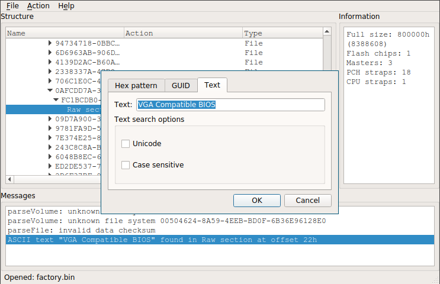

New system setup: Coreboot + Grub + Luks + Btrfs + Alpine
=========================================================

I used Arch Linux for some time, should switch to Alpine Linux for simplicity.
The setup will be on thinkpad x220 brought from [Kai Hendry][kaih], thanks to
him for keeping his laptop in good state. :)

Quick overview:

* Bootloader: Coreboot + Grub payload (testing)
* Encryption: Dm-crypt LUKS + key file from sd card
* Filesystem: Btrfs raid 0 (data) + raid 1 (metadata)
* Root setup: Alpine Linux

[kaih]: //hendry.iki.fi/

Setting up Coreboot
-------------------
Why switch to coreboot? Default firmware took 8s to boot. Now `x < 2s`. Haha!

1. Preparation

   1. Get raspberry pi 2 and [SOIC clip + probe cables][soic]
   2. Install flashrom and build coreboot with grub2 payload
   3. Prerequisite: `make crossgcc-i386 CPUS=4`, `make iasl`

2. Set up flasher - [coreboot wiki][wiki] and [tylercipriani][tyle]

   1. [Lenovo guide to remove keyboard and palm rest][lvid]
   2. Purge any power source of laptop & programmer (rpi2)
   3. Connect the probe cables between programmer and chip
   4. Then **only turn on the power source** of programmer

3. (Optional) Extracting the VGA BIOS which is better than SeaVGABios

   1. More info available at [nroach44][nr01] and [coreboot wiki][evga]
   2. Download, build [uefitool][uefi], open factory.rom with uefitool
   3. Search for text "VGA Compatible BIOS" with unicode **unchecked**
   4. Double click matching result, then extract body of `Raw section`
   5. (Optional) check word "VGA Display controller" with `romheaders`

4. (Optional) Cleaning up me.bin (now this option is in nconfig)

   1. More info available at [nroach44][nr02]
   2. Necessary: `util/me_cleaner/me_cleaner.py build/coreboot.bin`
   3. (Optional) Verify that `util/intelmetool/intelmetool -s` show
      output "Firmware Init Complete" as "NO"
   4. To proceed - `util/me_cleaner/me_cleaner.py me.bin` and `make`
   5. `hexdump me.bin` and check last byte which have tons of `ffff`
   6. `dd if=me.bin of=truc.bin bs=1 count=$(printf '%d' 0x00dbc90)`

5. (Optional) Setting battery threshold

   1. More info available at [vej's blog][vejb]
   2. Build util/ectool
   3. Battery start threshold 75% - `util/ectool -w 0xb1 -z 0x4b`
   4. Battery stop threshold 80%  - `util/ectool -w 0xb1 -z 0x50`

6. Building coreboot

   1. More info available at [coreboot wiki x220 page][wiki]
   2. First check `flashrom -p linux_spi:dev=/dev/spidev0.0`
   3. If it gets an error: poweroff, reconnect pin and boot
   4. `flashrom -p linux_spi:dev=/dev/spidev0.0 -r orig.bin`
   5. Check orig.bin hash & redo step 4-5, not same? step 2
   6. Extract the factory binary blob: `ifdtool -x orig.bin`
   7. Move outputs to `3rdparty/blobs/mainboard/lenovo/x220`
   8. Rename files as "descriptor.bin", "gbe.bin", "me.bin"
   9. `make nconfig` and tune it accordingly .config (dead)
   0. If it builds, verify with step 4-5 twice and finally:

          flashrom -p linux_spi:dev=/dev/spidev0.0 -w build/coreboot.rom

7. After coreboot is flashed, internal flashing can be done by:

   - `iomem=relaxed` in cmdline
   - `flashrom -p internal:laptop=force_I_want_a_brick`

8. Tips and tricks:

   - Find bootorder with `CONFIG_USE_OPTION_TABLE`, `CONFIG_CONSOLE_CBMEM`,
     `DEFAULT_CONSOLE_LOGLEVEL_6`, then `util/cbmem/cbmem -c | grep booto`.
   - The extra config such as `bootorder`, `config_seabios` can be set with
     `$(top)/src/mainboard/$(MAINBOARDDIR)/*` where you can store it inside
     `src/mainboard/lenovo/x220/` to differentiate between different boards.

[tyle]: //tylercipriani.com/blog/2016/11/13/coreboot-on-the-thinkpad-x220-with-a-raspberry-pi/
[wiki]: //www.coreboot.org/Board:lenovo/x220
[nr01]: //nroach44.id.au/index.php/2016/12/11/thinkpad-x220-coreboot-and-me-removal/
[nr02]: //nroach44.id.au/index.php/2017/01/24/thinkpad-x220-shrink-the-me-region/
[cbrp]: //review.coreboot.org/cgit/coreboot.git
[lvid]: //support.lenovo.com/us/en/videos/pd022683
[soic]: //www.ebay.com/itm/162284060668?_trksid=p2057872.m2749.l2649&ssPageName=STRK%3AMEBIDX%3AIT
[evga]: //www.coreboot.org/VGA_support#UEFI_Method
[uefi]: //github.com/LongSoft/UEFITool
[mecl]: //github.com/corna/me_cleaner
[vejb]: //wej.k.vu/coreboot/coreboot_on_the_lenovo_thinkpad_x220

Setting up a testing environment
--------------------------------
This is just some random stuff how I tested it out with qemu, might help.

Setting up full disk encryption
-------------------------------
For how it is now, I will just draw an image:

    +------------------------+     +------------------------+
    | /dev/sda1 111GB (root) |---->| /dev/mapper/p0 (crypt) |-------------+
    +------------------------+     +------------------------+             v
    | /dev/sda2   8GB (swap) |                                   +-----------------+
    +------------------------+                                   | / - btrfs raid0 |
                                                                 +-----------------+
    +------------------------+     +------------------------+             ^
    | /dev/sdb  119GB (root) |---->| /dev/mapper/p1 (crypt) |-------------+ 
    +------------------------+     +------------------------+              

- <https://wiki.archlinux.org/index.php/GRUB/Tips_and_tricks>
- <https://www.gnu.org/software/grub/manual/grub.html#Security>
- <https://www.reddit.com/r/coreboot/comments/4uahg5/coreboot_on_x220_examples_of_grubcfg_with_support>
- <https://notabug.org/vimuser/libreboot/src/master/resources/grub/config>
- <https://www.coreboot.org/GRUB2#Security>
